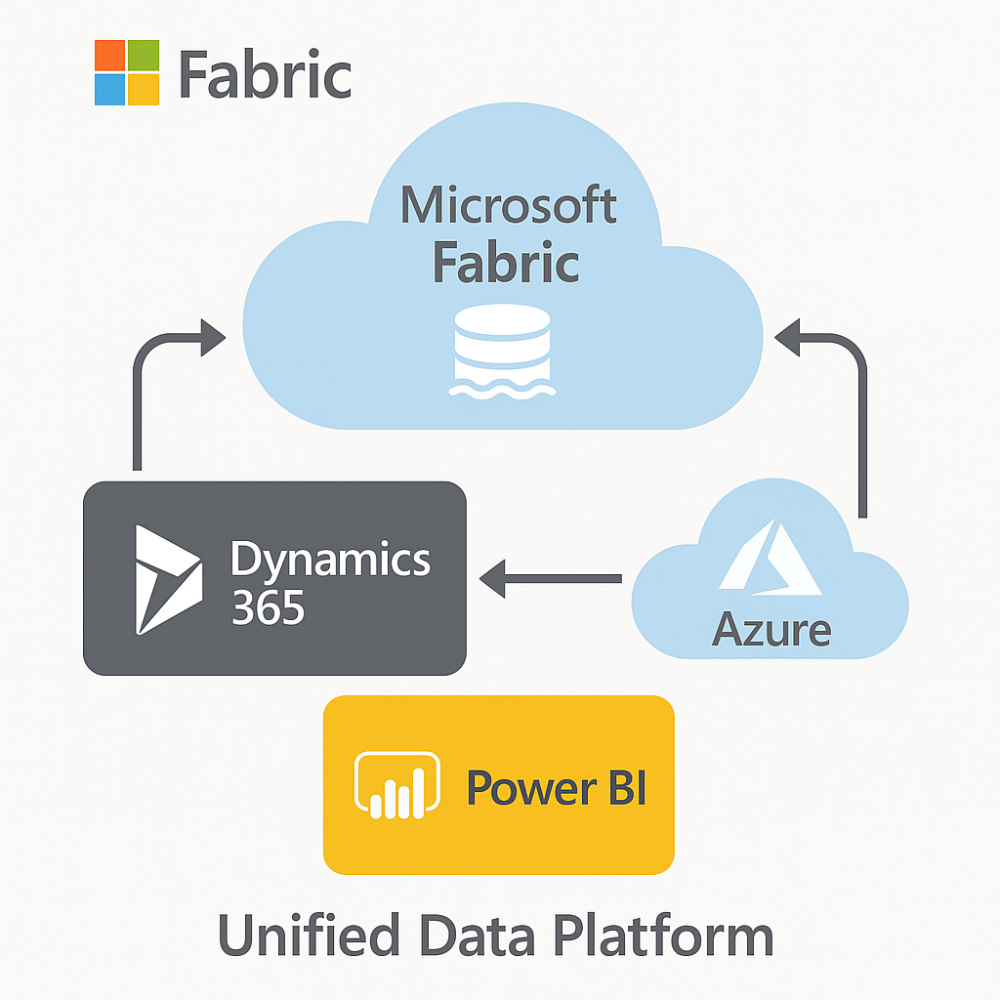

# Microsoft Fabric — The New Data Backbone for Dynamics 365

This diagram illustrates how Microsoft Fabric integrates with Dynamics 365, Azure, Power BI, and Copilot to create a unified data platform.

🧩 **Key Concepts**
- Dynamics 365 → Generates transactional data  
- Azure → Hosts data and analytics services  
- Microsoft Fabric → Centralizes and unifies data (OneLake)  
- Power BI & Copilot → Deliver insights and AI-driven analytics  

⚠️ Note: Fabric is currently not available in Iran, but it's shaping the future of CRM + Data + AI in the Microsoft ecosystem.

